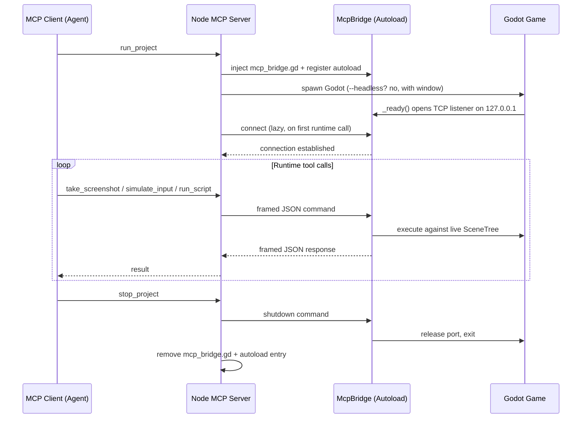

# Architecture

```
src/
├── index.ts                # MCP server entry point, server setup
├── dispatch.ts             # Tool-name → handler dispatch table
├── mcp.types.ts            # Shared MCP-contract types (OperationParams, ToolDefinition, ToolResponse, ToolHandler)
├── tools/
│   ├── project-tools.ts    # Project introspection (list_projects, get_project_info, files, search, settings, scene_dependencies)
│   ├── runtime-tools.ts    # Runtime/lifecycle (run_project, attach_project, take_screenshot, etc.)
│   ├── autoload-tools.ts   # Autoload management (list/add/remove/update_autoload)
│   ├── scene-tools.ts      # Scene creation, node addition, sprite loading, batch ops
│   ├── node-tools.ts       # Node properties, scripts, tree, duplication, signals
│   └── validate-tools.ts   # GDScript and scene validation
├── scripts/
│   ├── godot_operations.gd # Headless GDScript operations
│   └── mcp_bridge.gd       # TCP autoload for runtime communication
└── utils/
    ├── godot-runner.ts          # Process spawning, runtime session, bridge TCP client
    ├── output-parsing.ts        # Godot stdout parsing (extractJson, cleanOutput, cleanStdout, normalizeForCompare)
    ├── path-validation.ts       # Path-shape validators (validatePath, validateSubPath, validateNodePath, isUnderDir, projectGodotPath, checkDisplayAvailable)
    ├── error-response.ts        # Error helpers + arg validators (createErrorResponse, getErrorMessage, extractGdError, validateProjectArgs, validateSceneArgs)
    ├── parameter-conversion.ts  # camelCase ↔ snake_case parameter mapping
    ├── headless-op.ts           # executeSceneOp wrapper for headless-op handlers
    ├── bridge-manager.ts        # McpBridge artifact lifecycle (inject, cleanup, repair)
    ├── bridge-protocol.ts       # TCP framing (length-prefixed frames, port resolution)
    ├── autoload-ini.ts          # project.godot [autoload] INI primitives
    └── logger.ts                # logDebug / logError helpers
```

Headless operations spawn Godot with `--headless --script godot_operations.gd`, perform the operation, and return JSON. Runtime operations communicate over a long-lived TCP connection with the injected `McpBridge` autoload (4-byte big-endian length prefix + UTF-8 JSON frames).

## How the Bridge Works



When `run_project` or `attach_project` is called:

1. `mcp_bridge.gd` is copied into the project directory
2. It's registered as an autoload in `project.godot`
3. Godot launches with the bridge listening on `127.0.0.1`. Both `run_project` and `attach_project` auto-select a free port when `bridgePort` is omitted; pass `bridgePort` to pin a specific port. The resolved port is baked into the per-project bridge script at inject time, so the listener and the Node-side socket always agree.
4. The Node side opens a long-lived TCP connection on first runtime call and sends framed JSON commands; the bridge replies on the same connection
5. `stop_project` or `detach_project` sends a `shutdown` command (so the bridge releases the port cleanly), then removes the bridge script and autoload entry

## Runtime Artifacts

Files generated during runtime (screenshots, executed scripts) are stored in `.mcp/` inside the project directory. This directory is automatically added to `.gitignore` and has a `.gdignore` so Godot won't import it.

`take_screenshot` defaults to `responseMode: "preview"` — the full PNG is saved to `.mcp/screenshots/` and a 960x540-bounded preview is returned inline. Override per call:

- `responseMode: "full"` — return the full inline PNG when the agent needs to inspect exact pixels, small UI text, or texture detail.
- `responseMode: "path_only"` — skip the inline image entirely when another tool or human will inspect the saved file.
- `previewMaxWidth` / `previewMaxHeight` — override the default 960x540 preview bounds (e.g. `{ "responseMode": "preview", "previewMaxWidth": 480, "previewMaxHeight": 270 }`).

The response is a JSON text entry (`{ responseMode, path, size, previewPath?, previewSize?, warnings? }`) plus an inline `image` entry for `full` and `preview`.
