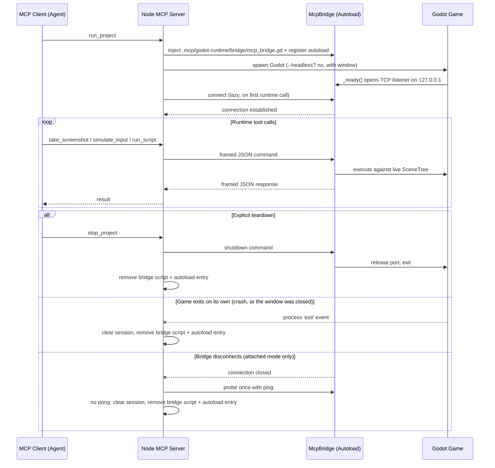

# Architecture

```
src/
├── index.ts                # MCP server entry point, server setup
├── dispatch.ts             # Tool-name → handler dispatch table
├── mcp.types.ts            # Shared MCP-contract types (OperationParams, ToolDefinition, ToolResponse, ToolHandler)
├── tools/
│   ├── project-tools.ts    # Project introspection (list_projects, check_project, files, search, settings, scene_dependencies)
│   ├── runtime-tools.ts    # Runtime/lifecycle (run_project, attach_project, take_screenshot, etc.)
│   ├── autoload-tools.ts   # Autoload management (list/add/remove/update_autoload)
│   ├── scene-tools.ts      # Scene creation, node addition, sprite loading, batch ops
│   ├── node-tools.ts       # Node properties, scripts, tree, duplication, signals
│   ├── profiler-tools.ts   # Function profiling (profile_project, start_profiler, stop_profiler)
│   └── validate-tools.ts   # GDScript and scene validation
├── scripts/
│   ├── godot_operations.gd # Headless GDScript operations
│   └── mcp_bridge.gd       # TCP autoload for runtime communication
└── utils/
    ├── godot-runner.ts          # Process spawning, runtime session, bridge TCP client
    ├── output-parsing.ts        # Godot stdout parsing (extractJson, cleanOutput, cleanStdout, normalizeForCompare)
    ├── path-validation.ts       # Path-shape validators (validatePath, validateSubPath, validateNodePath, isUnderDir, projectGodotPath, checkDisplayAvailable)
    ├── error-response.ts        # Error helpers (createErrorResponse, getErrorMessage, extractGdError) - argument validators live in arg-parsing.ts
    ├── arg-parsing.ts           # Generic field helpers + parseProjectArgs/parseSceneArgs/parseNodePath, returning Result<T, ToolResponse>
    ├── branded.ts               # Brand<T, Tag> nominal-type helper + ProjectPath/ScenePath/NodePath brands
    ├── result.ts                # Result<T, E> shape + ok/err/isOk/isErr used across the handler/parser/dispatch boundary
    ├── parameter-conversion.ts  # camelCase ↔ snake_case parameter mapping
    ├── headless-op.ts           # executeSceneOp wrapper for headless-op handlers
    ├── bridge-manager.ts        # McpBridge artifact lifecycle (inject, cleanup, repair)
    ├── bridge-protocol.ts       # TCP framing, port resolution, action-boundary sentinel + stderr bucketing
    ├── profiler.ts              # Godot remote-debugger receiver behind the profiling tools
    ├── godot-variant.ts         # Variant subset the remote debugger speaks on the wire
    ├── autoload-ini.ts          # project.godot [autoload] INI primitives
    ├── run-script-policy.ts     # Declarative Tier 1/2/3 rule table + evaluateScript() for run_script / run_project
    ├── gdscript-scanner.ts      # Hand-written GDScript tokenizer backing the run_script security gate
    ├── scene-parsing.ts         # .tscn / project.godot parsing for the run_project pre-flight scan (launch-scene resolution, ext_resource script extraction)
    ├── mcp-context.ts           # Request-scoped context (elicitor, strict-mode flag, per-session state) threaded through tool dispatch
    └── logger.ts                # logDebug / logError helpers
```

Headless operations spawn Godot with `--headless --script godot_operations.gd`, perform the operation, and return JSON. Runtime operations communicate over a long-lived TCP connection with the injected `McpBridge` autoload (4-byte big-endian length prefix + UTF-8 JSON frames).

## Cold Asset Import

Headless `--script` runs never import assets, and `PackedScene.pack()` serializes the live tree rather than the source `.tscn`. On a project with no `.godot/imported` (or one where an asset was just added), a scene referencing that asset loads with the property set to null and no error. Every mutation tool auto-saves, so a single `add_node` would rewrite the file without the reference and report success. The Godot editor never hits this because it imports before loading and blocks on its "Dependencies Broken" dialog. The server reproduces both guards.

Before `load()`, `load_scene_instance` in `godot_operations.gd` walks `ResourceLoader.get_dependencies()` for the scene and classifies each path. The batch pre-pass in `batch_scene_operations` does the same for every scene and first-time asset reference in the batch before any operation runs, and `load_sprite` and `res://` property strings run the same check on the asset they are about to load.

| `ResourceLoader.exists()` | file on disk | verdict                                                         |
| ------------------------- | ------------ | --------------------------------------------------------------- |
| false                     | yes          | never imported: print `[IMPORT_NEEDED]` to stderr and quit      |
| false                     | no           | missing: refuse the load and name the paths                     |
| true                      | any          | fine, or a failed import that already reports as a broken asset |

On the marker, `executeSceneOp` (`src/utils/headless-op.ts`) runs `GodotRunner.importAssets` (`godot --headless --import --path <project>`) and re-runs the operation exactly once. The cap is structural, not a loop: a marker on the second run falls through to normal error reporting. A live runtime session on the same project blocks the import, since it would write `.godot/` under a running game. The signal is self-terminating: a failed import still writes the `.import` sidecar, so `exists()` flips true and a corrupt asset is never re-probed. `--import` exits 0 even when individual assets fail, so `importAssets` parses the `Error importing '<file>'` lines on stderr and throws; a broken asset anywhere in the project therefore blocks the retry for every cold scene until it is fixed or removed.

Missing files are refused rather than tolerated because there is no non-destructive way through pack and save. `ResourceLoader.set_abort_on_missing_resources(false)` with `MissingResource` placeholders is the obvious thing to try and does not work here: the missing-file case still strips the reference, and the unimported case hangs the engine (verified at 4.6.2).

Dependency strings come in two shapes: bare `res://path`, and `uid://x::type::res://path` (type segment empty in practice) for every scene the editor has saved. `_resolve_dep_path` takes the segment after the last `::` and prefers the path `ResourceUID` currently maps the id to, so a file the editor moved resolves correctly. A probe that filters on a `res://` prefix silently skips the uid form, and hand-written test scenes never carry `uid=`, so the suite keeps a uid-form case to catch that regression.

## How the Bridge Works


```mermaid
sequenceDiagram
    participant Agent as MCP Client (Agent)
    participant Node as Node MCP Server
    participant Bridge as McpBridge (Autoload)
    participant Game as Godot Game

    Agent->>Node: run_project
    Node->>Bridge: inject .mcp/godot-runtime/bridge/mcp_bridge.gd + register autoload
    Node->>Game: spawn Godot (--headless? no, with window)
    Game->>Bridge: _ready() opens TCP listener on 127.0.0.1
    Node->>Bridge: connect (lazy, on first runtime call)
    Bridge-->>Node: connection established

    loop Runtime tool calls
        Agent->>Node: take_screenshot / simulate_input / run_script
        Node->>Bridge: framed JSON command
        Bridge->>Game: execute against live SceneTree
        Bridge-->>Node: framed JSON response
        Node-->>Agent: result
    end

    alt Explicit teardown
        Agent->>Node: stop_project
        Node->>Bridge: shutdown command
        Bridge->>Game: release port, exit
        Node->>Node: remove bridge script + autoload entry
    else Game exits on its own (crash, or the window was closed)
        Game--xNode: process 'exit' event
        Node->>Node: clear session, remove bridge script + autoload entry
    else Bridge disconnects (attached mode only)
        Bridge--xNode: connection closed
        Node->>Bridge: probe once with ping
        Node->>Node: no pong: clear session, remove bridge script + autoload entry
    end
```

When `run_project` or `attach_project` is called:

1. `mcp_bridge.gd` is copied to `.mcp/godot-runtime/bridge/` inside the project
2. It's registered as an autoload in `project.godot` as `res://.mcp/godot-runtime/bridge/mcp_bridge.gd`
3. Godot launches with the bridge listening on `127.0.0.1`. Both `run_project` and `attach_project` auto-select a free port when `bridgePort` is omitted; pass `bridgePort` to pin a specific port. The resolved port is baked into the per-project bridge script at inject time, so the listener and the Node-side socket always agree.
4. The Node side opens a long-lived TCP connection on first runtime call and sends framed JSON commands; the bridge replies on the same connection
5. `stop_project` or `detach_project` sends a `shutdown` command (so the bridge releases the port cleanly), then removes the bridge script and autoload entry
6. The same removal runs without a tool call when the session ends on its own: a spawned process that exits, an attached bridge that disconnects, or the server itself shutting down (signal, stdin close, or process exit). `stop_project` remains worth calling (it frees the retained process slot and returns the captured logs), but forgetting it does not strand artifacts in the project

## Input Batches

`simulate_input` sends one `input` command carrying the whole batch, and the bridge drives it one action at a time. The shape of that loop is what makes the per-action results trustworthy.

1. **One action at a time, each settling before anything is read.** `Input.parse_input_event` queues the event; the engine flushes the queue at the next frame boundary. In the frame an event is submitted, no handler has run and no UI has changed. So every injecting action awaits exactly one `process_frame` after injection, and only then reads signals, the hovered control, the focus owner, and the visible-Control snapshot. A `wait` injects nothing and therefore adds no settle frame, which is what makes its reported `frame` exactly the frames it waited.

2. **A `printerr` sentinel marks each boundary.** After an action settles, the bridge prints `MCP_ACTION_BOUNDARY <index>` to stderr. `printerr`, not `print`: stdout and stderr are separate pipes with no relative ordering between them, so a sentinel on stdout could not bracket an error on stderr. Because stderr is one ordered stream, every GDScript error line that appears between boundary `i-1` and boundary `i` came from action `i`, which is the whole attribution mechanism. There is no per-action channel in the response for it.

3. **The Node side waits, briefly, for the last sentinel.** The TCP response can arrive before the engine's stderr has drained, so `collectActionErrors` polls for the expected boundary count on a bounded deadline. On timeout it attributes what arrived and pools the rest onto the last executed entry: attribution degrades, the lines are never dropped, and nothing blocks indefinitely.

4. **Sentinels are stripped at ingestion, exactly once.** `GodotRunner.ingestStderrChunk` is the only writer of the session's stderr buffer. It records sentinel lines as boundary marks and never pushes them into the buffer, so `get_debug_output`, `stop_project`'s `finalErrors`, and every other reader are clean without a per-read filter. Nothing else in the tree may print that string; a game that did would corrupt attribution.

The sentinel constant lives in `src/utils/bridge-protocol.ts` and `src/scripts/mcp_bridge.gd`, one definition each, both marked KEEP IN SYNC.

## Runtime Artifacts

Files generated during runtime are stored under `.mcp/godot-runtime/` inside the project directory: the injected bridge autoload in `bridge/`, screenshots in `screenshots/`, `run_script` audit pairs in `scripts/`, and validation temp files in `validate/`. `.mcp/` is automatically added to `.gitignore` and carries a `.gdignore` so Godot won't import the subtree. Stopping a session removes `bridge/` and the autoload entry; the other directories persist, so screenshot paths handed back earlier still resolve and the audit trail survives.

`take_screenshot` defaults to `responseMode: "preview"` - the full PNG is saved to `.mcp/godot-runtime/screenshots/` and a 960x540-bounded preview is returned inline. Override per call:

- `responseMode: "full"` — return the full inline PNG when the agent needs to inspect exact pixels, small UI text, or texture detail.
- `responseMode: "path_only"` — skip the inline image entirely when another tool or human will inspect the saved file.
- `previewMaxWidth` / `previewMaxHeight` — override the default 960x540 preview bounds (e.g. `{ "responseMode": "preview", "previewMaxWidth": 480, "previewMaxHeight": 270 }`).

The response is a JSON text entry (`{ responseMode, path, size, previewPath?, previewSize?, warnings? }`) plus an inline `image` entry for `full` and `preview`.
