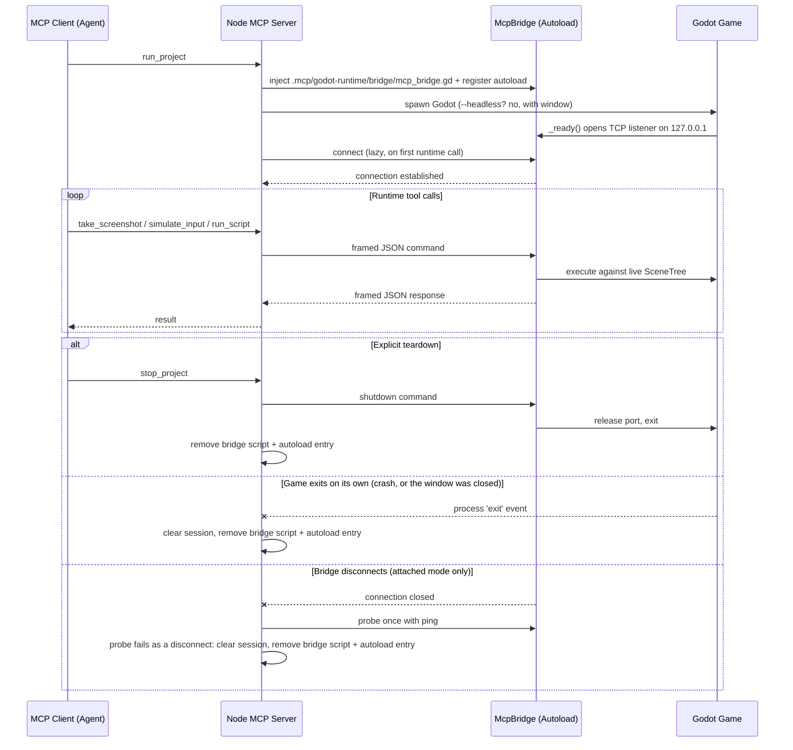

# Architecture

```
src/
├── index.ts                # MCP server entry point, server setup
├── dispatch.ts             # Tool-name → handler dispatch table
├── mcp.types.ts            # Shared MCP-contract types (OperationParams, ToolDefinition, ToolResponse, ToolHandler)
├── tools/
│   ├── project-tools.ts    # Project introspection (list_projects, check_project, files, search, settings, scene_dependencies)
│   ├── runtime-tools.ts    # Runtime/lifecycle (run_project in spawn and attach mode, switch_project, stop_project, take_screenshot, etc.)
│   ├── autoload-tools.ts   # Autoload management (list/add/remove/update_autoload)
│   ├── scene-tools.ts      # Scene creation, node addition, sprite loading, batch ops
│   ├── node-tools.ts       # Node properties, scripts, tree, duplication, signals
│   ├── profiler-tools.ts   # Profiling: functions, FPS, monitors, render stages (profile_project, start_profiler, stop_profiler)
│   ├── render-tools.ts     # Bridge-free movie-writer render check (render_movie)
│   └── validate-tools.ts   # GDScript and scene validation
├── scripts/
│   ├── godot_operations.gd # Headless GDScript operations
│   └── mcp_bridge.gd       # TCP autoload for runtime communication
└── utils/
    ├── godot-runner.ts          # Process spawning, per-project runtime sessions, bridge TCP client
    ├── godot-spawn-options.ts   # Spawn options per kind of Godot process (headless, run, run-background, movie, editor)
    ├── session-queue.ts         # SessionQueue: session transitions and bridge commands run one at a time, with a bounded wait
    ├── child-output.ts          # Utf8StreamDecoder and LineAssembler: a child's output decoded across chunk boundaries and stored as whole lines
    ├── output-parsing.ts        # Godot stdout parsing (extractOperationPayload, extractJson, cleanOutput, cleanStdout, normalizeForCompare)
    ├── path-validation.ts       # Path validators (validatePath, resolveProjectPath with its required read or write PathAccess, validateNodePath, isUnderDir, fileIdentityKey, projectSubPathError, projectGodotPath, checkDisplayAvailable)
    ├── error-response.ts        # Error helpers (createErrorResponse, getErrorMessage, extractGdError) - argument validators live in arg-parsing.ts
    ├── arg-parsing.ts           # Generic field helpers + parseProjectArgs/parseSceneArgs/parseNodePath, returning Result<T, ToolResponse>
    ├── branded.ts               # Brand<T, Tag> nominal-type helper + ProjectPath/ScenePath/NodePath brands
    ├── result.ts                # Result<T, E> shape + ok/err/isOk/isErr used across the handler/parser/dispatch boundary
    ├── parameter-conversion.ts  # camelCase ↔ snake_case parameter mapping
    ├── headless-op.ts           # executeSceneOp wrapper for headless-op handlers
    ├── structured-response.ts   # createStructuredResponse and leadWithWarnings: every success payload as structuredContent plus a JSON text block
    ├── session-report.ts        # No-fallback session gate and error wording shared by the runtime, profiler, edit and render handlers
    ├── bridge-manager.ts        # McpBridge artifact lifecycle (inject, cleanup, repair) and the owner registry
    ├── process-start-time.ts    # The start identity of the process holding a pid, so a reused pid is not taken for a live bridge owner
    ├── artifact-paths.ts        # Every path the server writes under .mcp/godot-runtime/, composed in one place
    ├── atomic-write.ts          # writeFileAtomicSync: temp file plus rename, with a Windows fallback
    ├── bridge-protocol.ts       # TCP framing, port resolution, action-boundary sentinel + stderr bucketing
    ├── profiler.ts              # Godot remote-debugger receiver behind the profiling tools
    ├── godot-variant.ts         # Variant subset the remote debugger speaks on the wire
    ├── project-godot.ts         # The one project.godot reader: statements identified by setting path, sections and line spans (scanProjectFile, findSetting, findSettingByPath), and the settings view get_project_settings returns
    ├── autoload-ini.ts          # project.godot autoload primitives: parse, add, remove and update, matched by setting path through project-godot.ts
    ├── launch-scene.ts          # run/main_scene resolution for a launch that names no scene, including a uid:// value
    ├── engine-version.ts        # Compares the running Godot's major.minor with the project's config/features version
    ├── scene-loss-guard.ts      # Compares a scene file's text before and after a headless save and writes the scene-backups copy when content was lost
    ├── run-script-policy.ts     # Declarative Tier 1/2/3 rule table + evaluateScript() for run_script / run_project
    ├── gdscript-scanner.ts      # Hand-written GDScript tokenizer backing the run_script security gate
    ├── launch-gate.ts           # Pre-flight script scan + once-per-project launch confirmation, callable by any handler that launches a project
    ├── png-decoder.ts           # Zero-dependency PNG decoder (8-bit RGB/RGBA) for pixel statistics
    ├── pixel-stats.ts           # Sampled color statistics, and the blank and motion verdicts decided over every pixel, measured from a decoded PNG
    ├── png-encoder.ts           # Zero-dependency RGB PNG encoder for downscaled inline frame previews
    ├── frame-preview.ts         # Box downscale and byte-capped PNG preview of a decoded frame
    ├── movie-process.ts         # Bounded Godot spawn for render_movie: output tails, timeout, process-tree kill
    ├── process-tree.ts          # killProcessTree, terminateProcessTree and waitForProcessEvent: how a spawned Godot is killed with its children and the exit observed, for sessions, headless runs and render_movie
    ├── scene-parsing.ts         # .tscn scanner behind the pre-flight scan and get_scene_dependencies, and the string-escape reader project.godot parsing shares
    ├── mcp-context.ts           # Request-scoped context (elicitor, strict-mode flag, per-session state) threaded through tool dispatch
    ├── progress-heartbeat.ts    # notifications/progress heartbeats for clients that attach a progress token
    ├── process-lifecycle.ts     # SIGINT/SIGTERM/SIGHUP/stdin-close/exit teardown, including every session's bridge artifacts
    └── logger.ts                # logDebug / logError helpers
```

Headless operations spawn Godot with `--headless --script godot_operations.gd`, perform the operation, and return JSON. That stdout is shared with the engine banner and with anything an autoload or scene script prints, so the result travels as one line prefixed with `MCP_OPERATION_RESULT:`, written by `emit_result` in `godot_operations.gd`. The prefix is a constant, and a project script can print it too, before the operation or after it (an autoload's `_exit_tree` runs after the result is written), so the position of such a line does not identify it. `executeOperation` draws a random token for each run and hands it to the script in the `MCP_OPERATION_RESULT_TOKEN` environment variable; the script takes it when it is constructed, removes it from the environment, and writes it between the prefix and the JSON. `cleanStdout` keeps only the line that carries that run's token and returns it behind the bare prefix, which is the form `extractOperationPayload` reads in the handlers; when no line carries the token, the prefix is removed from whatever else is passed on. Only the text after the frame on that line is ever parsed as a payload; stdout with no such line is reported as an operation that exited before producing a result. The token keeps a result apart from anything a script prints without it. It is not a boundary against a script written to defeat it, which runs in the same process as the operation. Runtime operations communicate over a long-lived TCP connection with the injected `McpBridge` autoload (4-byte big-endian length prefix + UTF-8 JSON frames).

### Headless operation lifecycle

`godot_operations.gd` extends `SceneTree` and does its work from `_initialize()`, which calls `_run_from_cmdline()` and then `quit()`, the only quit in the script. A failure path calls `_fail_operation()`, which records the failure and returns, and the closing quit passes exit code 1 when a failure was recorded or no result line was emitted, 0 otherwise. Its `_init()` only takes the result token. The work is not there: the engine registers the project's autoload singletons as GDScript globals after `_init` and before `_initialize`, so a scene script that names an autoload (`GameState.score`) fails to compile under `_init`, and the save then writes the node without its script and exported values. The operation finishes inside `_initialize`, before any autoload's `_ready` runs, so an autoload that quits or fails in `_ready` cannot pre-empt it. The dispatch sits in a callee because a runtime error aborts only the function it happens in: an error raised directly in `_initialize` would skip the closing `quit()` and leave the process running until the Node side killed it. `executeOperation` takes the script's own first stderr line, `[INFO] Operation:`, or a result line carrying the run's token on stdout as proof that dispatch started; the engine banner on stdout proves nothing. An autoload therefore fails headless operations only when it stops the engine before dispatch (a `quit()` in `_init`, for example), not when it errors in `_ready`.

A headless run that outruns its timeout is killed as a process tree, and the run waits a few seconds for the child's `close` event. The error says whether that exit was confirmed or the kill was only sent, because an engine that is still running may still save the scene the operation was editing.

A graceful server shutdown (a signal or the client closing stdin) stops every session and then waits for the headless runs still in flight, up to `HEADLESS_SHUTDOWN_WAIT_MS` (10 s), before the process exits (`shutDownRunner` in `src/utils/process-lifecycle.ts`). A run that closes inside the wait ends by itself. One that does not is killed by the exit hook, as before. From the moment the shutdown begins, `executeOperation` and `importAssets` refuse to start a new run, so the set being waited on only shrinks. The wait is there because the server has no evidence about what a kill during the engine's write of a scene file leaves on disk; that case has never been observed, and the wait bounds how often it can arise without proving it harmless. On Windows a closed console (`SIGHUP`) still exits at once, since the system ends the process a few seconds later regardless.

On Windows, Godot attaches to its parent's console when it starts, so a Godot spawned by a server running under a terminal client can write straight onto that client's screen. Every spawn option is decided in `godotSpawnOptions` (`src/utils/godot-spawn-options.ts`): the headless spawns (version probe, headless operations, asset import), a `background: true` game and the `render_movie` run pass `windowsHide: true`, the visible game and the editor never do because their windows must show, and all of them keep piped stdio, which `launch_editor` drains since nothing reads the editor's output. Outside Windows every kind the server later kills (headless, game, movie) is spawned as the leader of its own process group, so a signal sent to the group reaches a wrapper script and the engine it started; the editor is never killed by the server and stays in the server's group. A group leader is not signalled with the server by the terminal, so each such child is kept in a set the server's exit hook kills.

`windowsHide` is the cheap measure against that console painting, not a proven cure: the documentation does not settle whether a GUI-subsystem binary gets its own console under it, and no test can observe a terminal being painted over, so the tests cover the returned options only. A no-focus flag at window creation cannot be combined with the hidden show state (such a window is shown anyway), which is why the focus flags stay in the bridge. A server ended by SIGKILL runs no exit hook and nothing reaps these children: a spawned game notices through its parent watch and quits, and a headless run runs on to its own end.

## Cold Asset Import

Headless `--script` runs never import assets, and `PackedScene.pack()` serializes the live tree rather than the source `.tscn`. On a project with no `.godot/imported` (or one where an asset was just added), a scene referencing that asset loads with the property set to null and no error. Every mutation tool auto-saves, so a single `add_node` would rewrite the file without the reference and report success. The Godot editor never hits this because it imports before loading and blocks on its "Dependencies Broken" dialog. The server reproduces both guards.

Before `load()`, `load_scene_instance` in `godot_operations.gd` walks `ResourceLoader.get_dependencies()` for the scene and classifies each path. The batch pre-pass in `batch_scene_operations` does the same for every scene and first-time asset reference in the batch before any operation runs, and `load_sprite` and `res://` property strings run the same check on the asset they are about to load.

The pre-pass walks two kinds of value, and they do not follow the same rule. A path **parameter** (`scene_path`, `load_sprite`'s `texture_path`, an `add_node` `node_type` that names a scene) carries the tool surface's path convention: project-relative or `res://`. Each one goes through `normalize_scene_path`, the same helper its apply site uses, before it is classified, so a bare `assets/tex.png` is recognized as the asset reference it is. A free-form property **value** (an `add_node` `properties` dict, a `set_node_properties` update value, at any depth) is the other kind: there only a `res://` string is a resource reference, because that is the only form `_prepare_property_value` loads, and a bare string is just a string. Reading a path parameter with the property-value rule is how a cold texture reaches the apply site unprobed.

A value counts only when its target property is Object-typed (`_value_may_load_asset`), because `_prepare_property_value` stores a `res://` string on any other type as the string it is: `notes = "res://notes.txt"` on a String property or a `metadata/<name>` key is not an asset, and importing for it would be wrong. The pre-pass therefore runs in two phases. Phase A probes the path parameters and exits on a finding before anything is loaded. Phase B then instantiates the node an `add_node` creates and loads the scene a `set_node_properties` edits, to read each target's declared type, and exits again if a surviving value is cold. A target it cannot resolve is probed anyway: a node an earlier operation in the batch adds, or a property the node does not declare yet because the script that declares it is attached by the same `add_node`.

The marker is a request for a replay, so it has one emission point, `_report_import_needed`. `batch_scene_operations` disarms it as soon as one of its operations has mutated a cached scene, since every mutated scene is saved before the batch returns: past that point the same condition fails the batch loudly instead of asking for an import and a re-run that would apply the saved operations a second time. `executeSceneOp` carries the same refusal on the Node side, keyed on the payload rather than the operation name: a run that reports an applied step in its `results` array alongside the marker is never retried.

| `ResourceLoader.exists()` | file on disk | verdict                                                         |
| ------------------------- | ------------ | --------------------------------------------------------------- |
| false                     | yes          | never imported: print `[IMPORT_NEEDED]` to stderr and quit      |
| false                     | no           | missing: refuse the load and name the paths                     |
| true                      | any          | fine, or a failed import that already reports as a broken asset |

On the marker, `executeSceneOp` (`src/utils/headless-op.ts`) runs `GodotRunner.importAssets` (`godot --headless --import --path <project>`) and re-runs the operation exactly once. The cap is structural, not a loop: a marker on the second run falls through to normal error reporting. The import is waited for only while the retry still fits in the request: the call's budget is `CLIENT_REQUEST_TIMEOUT_MS` less `HEADLESS_RESPONSE_MARGIN_MS`, counted from the call's start, and the wait ends `IMPORT_RETRY_RESERVE_MS` before it (about 45 s in). An import that finished by then is followed by the retry, run with the time that is left. One that did not is left running and the call answers "still being imported, nothing was changed; retry this call". `importAssets` keeps one import in flight per project (`projectPathKey`) and hands a second caller the same promise, so that retry joins the running import instead of starting a second engine on the same `.godot/` directory. `validate` goes through the same bounded wait (`importWithinBudget`) and answers with the same error. A live runtime session on the same project blocks the import, since it would write `.godot/` under a running game. The signal is self-terminating: a failed import still writes the `.import` sidecar, so `exists()` flips true and a corrupt asset is never re-probed. `--import` exits 0 even when individual assets fail, so `importAssets` parses the `Error importing '<file>'` lines on stderr and throws; a broken asset anywhere in the project therefore blocks the retry for every cold scene until it is fixed or removed.

Missing files are refused rather than tolerated because there is no non-destructive way through pack and save. `ResourceLoader.set_abort_on_missing_resources(false)` with `MissingResource` placeholders is the obvious thing to try and does not work here: the missing-file case still strips the reference, and the unimported case hangs the engine (verified at 4.6.2).

Dependency strings come in two shapes: bare `res://path`, and `uid://x::type::res://path` (type segment empty in practice) for every scene the editor has saved. `_resolve_dep_path` takes the segment after the last `::` and prefers the path `ResourceUID` currently maps the id to, so a file the editor moved resolves correctly. A probe that filters on a `res://` prefix silently skips the uid form, and hand-written test scenes never carry `uid=`, so the suite keeps a uid-form case to catch that regression.

## How the Bridge Works


```mermaid
sequenceDiagram
    participant Agent as MCP Client (Agent)
    participant Node as Node MCP Server
    participant Bridge as McpBridge (Autoload)
    participant Game as Godot Game

    Agent->>Node: run_project
    Node->>Bridge: inject .mcp/godot-runtime/bridge/mcp_bridge.gd + register autoload
    Node->>Game: spawn Godot (--headless? no, with window)
    Game->>Bridge: _ready() opens TCP listener on 127.0.0.1
    Node->>Bridge: connect (lazy, on first runtime call)
    Bridge-->>Node: connection established

    loop Runtime tool calls
        Agent->>Node: take_screenshot / simulate_input / run_script
        Node->>Bridge: framed JSON command
        Bridge->>Game: execute against live SceneTree
        Bridge-->>Node: framed JSON response
        Node-->>Agent: result
    end

    alt Explicit teardown
        Agent->>Node: stop_project
        Node->>Bridge: shutdown command
        Bridge->>Game: release port, exit
        Node->>Node: remove bridge script + autoload entry
    else Game exits on its own (crash, or the window was closed)
        Game--xNode: process 'exit' event
        Node->>Node: clear session, remove bridge script + autoload entry
    else Bridge disconnects (attached mode only)
        Bridge--xNode: connection closed
        Node->>Bridge: probe once with ping
        Node->>Node: probe fails as a disconnect: clear session, remove bridge script + autoload entry
    end
```

When `run_project` is called, in either mode:

1. `mcp_bridge.gd` is copied to `.mcp/godot-runtime/bridge/` inside the project
2. It's registered as an autoload in `project.godot` as `res://.mcp/godot-runtime/bridge/mcp_bridge.gd`
3. Godot launches with the bridge listening on `127.0.0.1`. Both modes auto-select a free port when `bridgePort` is omitted; pass `bridgePort` to pin a specific port. A spawned session delivers the resolved port to the process via the `MCP_BRIDGE_PORT` environment variable, so the on-disk script stays identical for every spawned session regardless of which one wrote it. Attach mode (`attach: true`) has no env-var channel into a Godot process the user launched themselves, so it bakes the port (and the auth token) into the per-project bridge script at inject time instead.
4. The Node side opens a long-lived TCP connection on first runtime call and sends framed JSON commands; the bridge replies on the same connection
5. `stop_project` sends a `shutdown` command (so the bridge releases the port cleanly), then removes this session's registry entry. A spawned process is stopped and the stop waits for its `exit` event, escalating to a forced tree kill, then briefly for its stdout and stderr to end so the last lines are in the logs the stop returns; a kill that was sent and never confirmed is reported as `killUnconfirmed`, not as a stop. An attached process is left running. The shared bridge script and autoload entry are removed only when no other live session remains on the project (see "Multiple sessions on one project" below). `BridgeManager.cleanup` returns the steps it attempted and could not confirm (the autoload entry is read back from `project.godot` after its removal), and `stop_project` leads its response with them as `warnings`, along with an attached bridge that never acknowledged the `shutdown`.
6. The same removal runs without a tool call when the session ends on its own: a spawned process that exits, an attached bridge that disconnects, or the server itself shutting down (signal, stdin close, or process exit). `stop_project` remains worth calling (it frees the retained process slot and returns the captured logs), but forgetting it does not strand artifacts in the project
7. A spawned game also receives `MCP_PARENT_WATCH_PORT`, the port of a listener that lives as long as the server process. The bridge keeps one connection to it open and checks it every two seconds; when an established connection is lost, the game quits. This covers a server that was killed outright and never ran its exit hook. An attached Godot never gets the variable.

A start is ordered so that one that cannot happen costs nothing. Every check that can refuse runs first: the display, the port, the debugger listener, and `BridgeManager.precheckInject` (the template is usable, `McpBridge` is not a user's own autoload, no other live session holds the attach slot, the owner registry can be read, `project.godot` can be written). Only then is the session the start replaces stopped. Any failure of the inject itself fails the start at once, instead of launching a game that could only time out waiting for a bridge it never loaded.

### Multiple sessions on one project

N server processes can share one project at once. Every entry point reads disk state rather than trusting in-memory bookkeeping, because a sibling process's inject or cleanup can change that state at any moment. Ownership is tracked with a small on-disk registry: `.mcp/godot-runtime/bridge/owners/<pid>-<instanceId>.json`, one file per live session, written by `inject` before `project.godot` is touched and removed by that same session's `cleanup`. An owner is considered live when its hostname does not match this host (unknowable, so treated conservatively as live), or when its pid answers a liveness probe and the process holding that pid is the one that wrote the file. The owner file records the writer's own start identity (`processStart`, from `src/utils/process-start-time.ts`): a value the operating system fixes when the process is created, so two readings of one process are equal whatever the wall clock did in between. A server that was killed outright leaves its owner file behind, and the operating system can hand its pid to an unrelated process; a different identity under the same pid is how that is told apart. Unknown means live: an owner file with no recorded identity (an older build), or a pid whose identity cannot be read now, keeps the pid answer. Reading the identity runs a helper program on Windows and macOS, so an answer is cached for a while, an unknown one included, and the synchronous exit path never spawns one. Dead owner files are pruned opportunistically whenever the registry is read; `peekOtherLiveOwners` is the read that prunes nothing, for `render_movie`, which has promised to write nothing before its launch gate.

The shared script and autoload entry are created on the first live session's inject and removed only by the last live session's cleanup. A same-project restart (`run_project` called again without an intervening `stop_project`, the scenario reported in issue #61) always re-reads disk rather than trusting a per-process "already injected" flag, so a missing autoload entry gets restored even when the script itself was already present. A removal reads the registry again after it has removed the artifacts, and puts them back for a session that registered in between: an inject writes its owner file before it looks at the script and the entry, so whichever way the two interleave, one side sees the other. The removal deletes only the `McpBridge` assignments that point at a server-owned path; a user's own line with the same name stays.

Attach mode allows at most one live attach owner per project, because it bakes its port and token into the one shared script: a second `run_project` with `attach: true` on a project another session has already attached to is refused before any write, naming the other session's pid. When the session already attached is this server's own and its bridge still answers, the call returns that session with a warning instead of injecting a new port and token the running Godot would never read. Spawned sessions carry no such limit, since they deliver their port through the environment and never bake anything.

A headless scene-editing call also checks for another server's live session on the project, not just its own: if one is found, the call is refused with a message naming that session's pid and mode, since this session cannot stop a game it does not own. An owner registered from another host cannot be probed and counts as live, so that refusal also names the host and the owner file; deleting the file is the way out when the session is known to be gone (a project copied from another machine, or a renamed host). Only a missing registry directory counts as an empty registry. One that exists and cannot be listed, or that holds an owner file that cannot be read, is unknown: the edit guard, `render_movie` and `run_project` refuse with the reason, and a cleanup leaves the shared script and autoload entry in place instead of removing them.

Accepted gaps: two servers racing a read-modify-write on `project.godot` in the same instant can still lose one edit (writing the owner file first keeps the window tiny, and the next inject from either side restores the entry); and an older server version sharing a project writes no owner file, so it is invisible to this registry.

### Sessions on several projects

`GodotRunner` holds one session record per project in a map keyed by the normalized absolute project path (`sessionKey`), plus a `current` pointer to at most one of them. `run_project` adds or replaces only the record for its own project and points `current` at it. The `active*` accessors are read-only views of the current record, so a handler cannot reach another project's session by accident; anything else goes through `getSessionInfo(projectPath)` and the other snapshot methods.

There is one bridge socket. It belongs to the session it was dialed for, and `switch_project` closes it so the next command lazy-connects to the new current session's port with that session's token. One channel is enough because the server runs one operation at a time: every start, every switch and every bridge command goes through the runner's `SessionQueue` (`src/utils/session-queue.ts`), so tool calls a client issues in parallel wait their turn instead of interleaving. A waiter gives up after `SESSION_QUEUE_WAIT_TIMEOUT_MS` (30 s, half the SDK's default request timeout) with an error naming the operation it waited behind. A call made from inside the operation that holds the queue runs at once. A stop does not queue: `stop_project`, server shutdown and the process exit handlers act at once, because the operation holding the queue can be a script that never returns. The first statements of a stop are synchronous and are what make that safe. The record's epoch moves, its `stopped` flag is set, and the command in flight to it is rejected with `SessionStoppedError`, which nothing retries or probes. Every later command to that record is refused the same way before a socket is dialed, a bridge wait on it ends as stopped, and the `shutdown` request goes to the bridge over a connection of its own (`requestOnce`), never over the command socket. A second stop of a record already being stopped shares the first one's result. A start measures its bridge wait from the moment it asked for its turn (`startBridgeWaitDeadline`), so the queue wait, the checks and the stop of the session it replaces are all charged to it, and one with less than `BRIDGE_WAIT_FLOOR_MS` left is refused with `StartBudgetExhaustedError` before it stops or spawns anything. A session that has no bridge port (its game exited) is never dialed, and a connect that outlives the command that started it is discarded, so a frame only travels on a socket dialed for the session whose token it carries.

Each record carries its own epoch, bumped at the head of every transition that stops or supersedes that session. A spawned process's `'exit'` handler compares the epoch it captured with the record's, so an exit from a superseded process cannot clean the bridge its replacement just injected, and starting project B never makes project A's own later exit look stale. The start itself is guarded differently. Every await of a start comes before its record exists, and a shutdown landing there finds no record to stop, so `stopAllSessions` sets a flag that never clears and the start checks it after those awaits (`assertNotShuttingDown`); once it is set the server has stopped everything, and the start throws instead of injecting a bridge and spawning a process nothing tracks. From the record's creation to the spawn a start does not await, so nothing can land in between.

The current pointer is never moved implicitly. Stopping the current session leaves it empty, and a game that exits by itself stays current with its logs retained. A start that fails before it launched anything gives the pointer back to the session that held it before the call, when that session is still registered; a start that launched a game and then failed leaves it empty. `src/utils/session-report.ts` formats the resulting errors: `requireRuntimeSession` is the gate the runtime handlers share and `requireProfiler` the profiling handlers' (in `src/tools/profiler-tools.ts`); both list the live sessions instead of choosing one. The headless-edit guard and `render_movie` ask `hasLiveSessionOnProject`, so a live session blocks edits on its project whether or not it is current, and the refusal says to `switch_project` first when it is not. Server shutdown stops every session and waits, bounded, for headless runs in flight (see "Headless operation lifecycle"), and the synchronous exit handler kills any spawned game or headless run that is still running and then removes every session's bridge artifacts. A spawned game is always killed as a process tree (`src/utils/process-tree.ts`), because the pid the spawn returned can be a wrapper around the real engine process. A kill function returns what the call itself can tell (`signalled`, `not-running` or `failed`); that the process died is known only from its `exit` or `close` event, which the callers wait for. A profiler capture's track is the one profiler step that needs the bridge, so `collectTrack` in `src/tools/profiler-tools.ts` collects it only while the session that ran the capture is current.

## Input Batches

`simulate_input` sends one `input` command carrying the whole batch, and the bridge drives it one action at a time. The shape of that loop is what makes the per-action results trustworthy.

1. **One action at a time, each settling before anything is read.** `Input.parse_input_event` queues the event; the engine flushes the queue at the next frame boundary. In the frame an event is submitted, no handler has run and no UI has changed. So every injecting action awaits exactly one `process_frame` after injection, and only then reads signals, the hovered control, the focus owner, and the visible-Control snapshot. A `wait` injects nothing and therefore adds no settle frame, which is what makes its reported `frame` exactly the frames it waited.

2. **A `printerr` sentinel marks each boundary.** After an action settles, the bridge prints `MCP_ACTION_BOUNDARY <index>` to stderr. `printerr`, not `print`: stdout and stderr are separate pipes with no relative ordering between them, so a sentinel on stdout could not bracket an error on stderr. Because stderr is one ordered stream, every GDScript error line that appears between boundary `i-1` and boundary `i` came from action `i`, which is the whole attribution mechanism. There is no per-action channel in the response for it.

3. **The Node side waits, briefly, for the last sentinel.** The TCP response can arrive before the engine's stderr has drained, so `collectActionErrors` polls for the expected boundary count on a bounded deadline. On timeout it attributes what arrived and pools the rest onto the last executed entry: attribution degrades, the lines are never dropped, and nothing blocks indefinitely.

4. **Sentinels are stripped at ingestion, exactly once.** `GodotRunner.ingestStderrChunk` is the only writer of the session's stderr buffer. It records sentinel lines as boundary marks and never pushes them into the buffer, so `get_debug_output`, `stop_project`'s `finalErrors`, and every other reader are clean without a per-read filter. Nothing else in the tree may print that string; a game that did would corrupt attribution. The same ingestion point stores complete lines only (`LineAssembler` in `src/utils/child-output.ts`): the tail of a chunk is held until the chunk that finishes it, so a line that arrived in two chunks is one entry and half a line is never classified as a whole one. A stored line carries no `\r`, a blank line is not stored, and a stripped sentinel leaves no empty entry behind. A line that never ends is cut at 65536 characters with a marker. Bytes are decoded per stream across chunk boundaries (`Utf8StreamDecoder`), so a multi-byte character split between two chunks is not turned into replacement characters. `ingestStdoutChunk` applies the same rules to stdout.

The sentinel constant lives in `src/utils/bridge-protocol.ts` and `src/scripts/mcp_bridge.gd`, one definition each, both marked KEEP IN SYNC.

## Runtime Artifacts

Files generated during runtime are stored under `.mcp/godot-runtime/` inside the project directory: the injected bridge autoload in `bridge/`, screenshots in `screenshots/`, `run_script` audit pairs in `scripts/`, validation temp files in `validate/`, `render_movie` output in `movies/<run id>/`, and scene backups in `scene-backups/<run id>/`. `.mcp/` is automatically added to `.gitignore` and carries a `.gdignore` so Godot won't import the subtree. Stopping a session removes `bridge/` and the autoload entry; the other directories persist, so screenshot paths handed back earlier still resolve and the audit trail survives.

`scene-backups/` is written by the headless editing tools, not by a session. `executeSceneOp` reads each scene an operation is about to write, runs the operation, and compares the file's text before and after (`src/utils/scene-loss-guard.ts`). The comparison is on text because the engine's own view of the scene is the thing that lost the content. When the save dropped something the operation did not ask to change, the pre-save file is copied to `scene-backups/<run id>/<scene path>` and the payload leads with warnings that name it. The "before" text is the file as it was before the first attempt, so a cold-import retry is measured against what the caller had, not against what the first attempt wrote. The server never removes a backup. A save that cannot be compared (the file before or after it is not a text scene) leads the payload with one "not checked" warning and writes no backup. What counts as a loss is listed in `docs/tools.md` under "When a save drops content".

`render_movie` is the one launcher that never touches the bridge. It spawns Godot with `--write-movie` through `runMovieProcess` in `src/utils/movie-process.ts`, holds no session state on the runner, and reads the result from disk: PNG frames are decoded and measured by the same Node-side statistics module `take_screenshot` uses: the color statistics are sampled on a grid, while blankness and motion are decided over every pixel. The call is bounded by a timeout that scales with the requested frames, and a timeout kills the whole process tree. `check` runs delete their directory before returning; `frames` and `video` runs stay until someone deletes them.

A movie run and a start on the same project must not overlap: the start injects the bridge, and the movie process would load it with no token and no port. Inside one server process the two are kept apart by the session queue and a registry on the runner. The handler makes its second session check, creates the run directory, calls `GodotRunner.beginMovieRun` and spawns the child as one step under `runExclusive('render_movie', ...)`, then releases the queue; it never holds it for the render. `runProject` and `attachProject` run under the same queue and refuse in their first phase (`assertNoMovieRun`, beside `assertBridgePortNotHeld`) while the registry names the project. The registry entry ends when the child reports `close` (the `onClosed` hook of `runMovieProcess`), not when the call returns, so a child that outlived its timeout kill still refuses a start. The registry is memory in one process. Two server processes on one project still have the window: a movie run registers no bridge owner, so the other server's start cannot see it, and the movie handler's own owner-registry check can pass a moment before the other server's inject. That window is not closed.

`take_screenshot` defaults to `responseMode: "preview"` - the full PNG is saved to `.mcp/godot-runtime/screenshots/` and a 960x540-bounded preview is returned inline. Override per call:

- `responseMode: "full"`: return the full inline PNG when the agent needs to inspect exact pixels, small UI text, or texture detail.
- `responseMode: "path_only"`: skip the inline image entirely when another tool or human will inspect the saved file.
- `previewMaxWidth` / `previewMaxHeight`: override the default 960x540 preview bounds (e.g. `{ "responseMode": "preview", "previewMaxWidth": 480, "previewMaxHeight": 270 }`). Values above 1920 and 1080 are clamped to those.

The response is a JSON text entry (`{ warnings?, projectPath, responseMode, path, size, stats, previewPath?, previewSize? }`) plus an inline `image` entry for `full` and `preview`. `stats` is measured from the full PNG in every mode and is `null`, with a leading warning, when the PNG could not be measured. An image file over 3 MiB, or a `full` PNG that could not be decoded, is not inlined: the path is returned with a leading warning instead.
